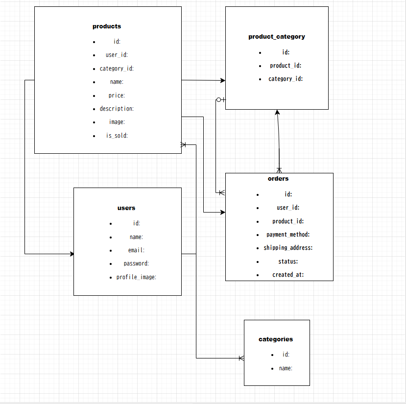

Markdown
# COACHTECH フリマ（フリマアプリ）

ユーザー間で商品を売買できる、Stripe決済機能を搭載したフリマアプリケーションです。
## 1. 環境構築

### Dockerビルド
 **リポジトリのクローン**
   ```bash
   git clone [https://github.com/sakamoto242/coachtech-furima.git](https://github.com/sakamoto242/coachtech-furima.git)

Dockerコンテナの起動

Bash
docker-compose up -d --build
Laravel環境構築
コンテナ内へログイン

Bash
docker-compose exec php bash
プロジェクト内での操作

Bash
composer install
php artisan key:generate
php artisan migrate --seed

初期設定コマンド

Bash
php artisan key:generate
php artisan migrate
php artisan db:seed

使用技術
PHP: 8.x
Laravel: 10.x
MySQL: 8.0
Stripe API (決済処理)

### Stripe 決済の準備（ローカル開発環境）
Stripe CLIを起動し、Webhookの転送を開始する。
Bash
.\stripe listen --forward-to localhost/stripe/webhook
表示された whsec_... を .env の STRIPE_WEBHOOK_SECRET に設定する。

## 3. ER図



 URL
開発環境: http://localhost/

phpMyAdmin: http://localhost:8080/
